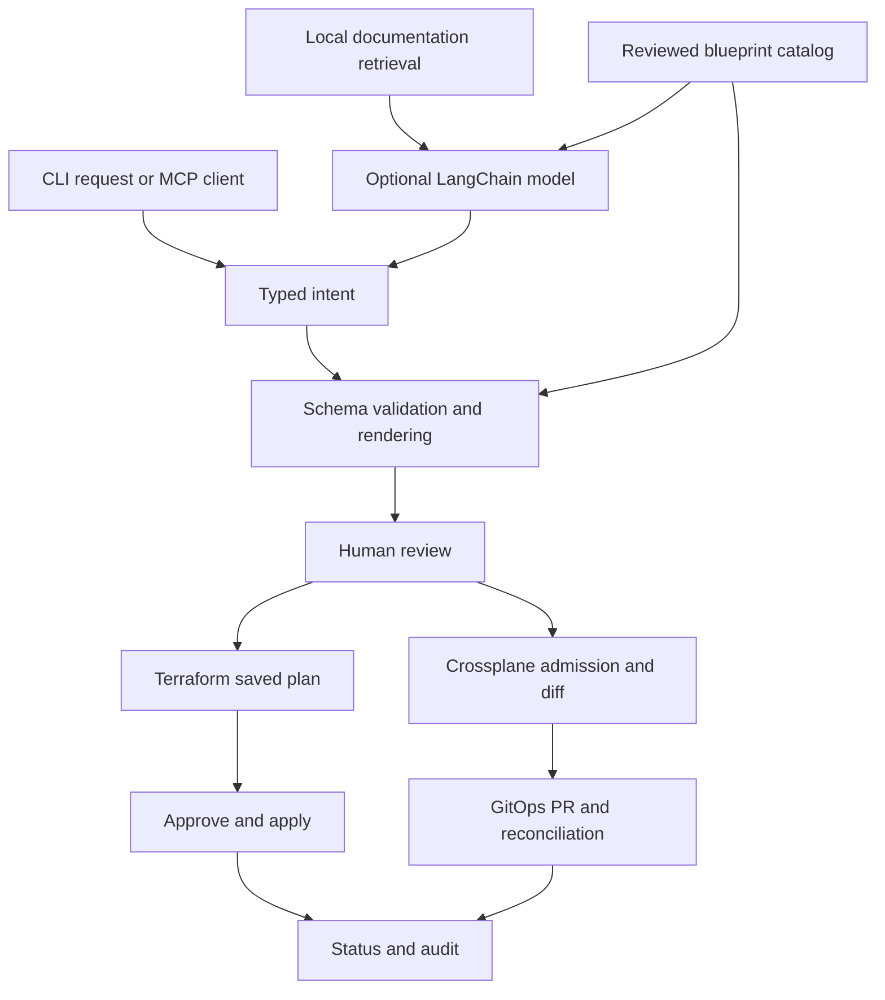

# ForgeIaC

**Describe infrastructure. Review the plan. Ship it with your toolchain.**

An open-source, catalog-driven AI infrastructure agent for **Terraform and Crossplane**.
Use OpenAI, Anthropic, Ollama or another LangChain provider. Keep your approved modules,
Compositions, cloud credentials and GitOps controls in charge.

**Status: v0.1.0 alpha.** A working local CLI and MCP proposal server, with a no-cloud
Terraform demo and Azure starter blueprints. This is an extensible first release,
not a claim of production certification or support for every cloud resource.

## Why this exists

Platform teams already have good IaC. Developers should be able to request it in ordinary
language without handing a language model a shell and production credentials.
ForgeIaC translates requests into **typed blueprint parameters**, renders deterministic IaC,
then uses the real infrastructure tools to validate and provision it.

- **Bring your AI:** optional LangChain adapter, local Ollama support, deterministic mode.
- **Bring your IaC:** JSON catalog entries for Terraform configurations and Crossplane XRs.
- **Review before execution:** saved Terraform plans; Kubernetes dry-run and object diffs.
- **GitOps first for Crossplane:** export a Kustomization for Flux or Argo CD; explicit direct
  mode for a development cluster. No cluster-side scripts or provisioning pipeline required.
- **Guardrails:** parameter schemas, destructive Terraform change blocking, change-count limit,
  one-hour approvals, artifact hashing, target checks and single-run locking.
- **Grounding:** local Markdown RAG using SQLite FTS5, with source citations. No vector database
  or embeddings bill needed to start.
- **MCP:** discover offerings and generate proposals from your preferred assistant. The MCP
  server deliberately has no apply, shell or approval tool.
- **Observable lifecycle:** run IDs, local audit events, readiness checks and bounded waiting.
- **Open development:** Apache-2.0, contribution guide, security reporting, CI and tagged releases.

## Try it in five minutes

Requirements: Python 3.11+, macOS/Linux (Windows: WSL2), and Terraform 1.9+ for execution.
The repository and no-AI proposal path require no cloud credentials.

```bash
python -m venv .venv
source .venv/bin/activate
pip install -e '.[dev]'
forgeiac doctor
forgeiac catalog
forgeiac request --blueprint local-demo --set name=hello-platform
```

Copy the returned `run` value:

```bash
forgeiac show RUN_ID
forgeiac plan RUN_ID
```

Review the generated configuration and plan. Copy the full `approval` digest:

```bash
forgeiac apply RUN_ID --approve APPROVAL_DIGEST
forgeiac status RUN_ID
```

This creates only a built-in `terraform_data` object in local Terraform state. It does not
create cloud resources. Expected lifecycle: `proposed → planned → applied`.
A second `plan` produces a `no-op` for the demo. Each plan needs a fresh review.

**Keep `.forgeiac/`.** It contains the Terraform state and saved plans for your runs. It is
ignored by Git and created with private permissions. One run represents one resource stack.
Use `revise`, not a new request, to update that stack:

```bash
forgeiac revise RUN_ID --set environment=staging
forgeiac plan RUN_ID
# Review, then apply with the new approval digest.
```

## Turn on AI

```bash
pip install -e '.[ai]'
export OPENAI_API_KEY='your-key'
export FORGEIAC_MODEL='openai:YOUR_MODEL_NAME'
forgeiac request 'Create a demo called hello-platform for staging' --engine terraform
```

Use any model name available to your account. Other examples:

```bash
export ANTHROPIC_API_KEY='your-key'
export FORGEIAC_MODEL='anthropic:YOUR_MODEL_NAME'
# Or, with Ollama installed, running, and the model downloaded:
export FORGEIAC_MODEL='ollama:llama3.1:8b'
```

Provider integrations differ in configuration and capabilities; install additional
`langchain-*` packages for other providers. The supported interface is JSON text, so native
tool calling is not required. Malformed output gets one retry. Missing required values fail
with the fields to supply; nothing is provisioned. Add explicit `--set key=value` values to
complete or override the proposal. `.env` is an example only, not loaded automatically.

Only request text, catalog parameter descriptions and retrieved snippets go to the configured
model. Never put credentials in prompts, parameters or indexed documents. `--blueprint` bypasses
the model entirely and is useful for CI tests, restricted environments and reproducibility.

## Provision Azure using Terraform

Authenticate with Azure CLI or workload identity, then select your subscription explicitly:

```bash
az login
forgeiac request --blueprint azure-resource-group-tf \
  --set name=team-dev-rg --set location=canadacentral \
  --set subscription_id=YOUR_SUBSCRIPTION_UUID
forgeiac show RUN_ID
forgeiac plan RUN_ID
forgeiac apply RUN_ID --approve REVIEWED_APPROVAL_DIGEST
```

This is real provisioning and requires Azure permissions and provider registry access.
The subscription is rendered into provider configuration, not inferred by the model.
The sample uses local state for a single operator. Before team/production use, configure a
remote locking backend in your reviewed blueprint; see [Terraform operations](docs/terraform.md).

## Provision through Crossplane + GitOps

First have your platform team install the namespaced Azure provider, ProviderConfig,
patch-and-transform function, and example XRD/Composition described in
[Crossplane setup](docs/crossplane.md). Your existing Helm/Flux Composition distribution can
stay in place; a catalog entry can point directly to your existing XR API instead.

```bash
forgeiac request --blueprint azure-resource-group-xr \
  --set name=team-dev-rg --set namespace=platform --set location=canadacentral
forgeiac show RUN_ID
forgeiac plan RUN_ID --context YOUR_KUBE_CONTEXT
forgeiac export RUN_ID --approve REVIEWED_APPROVAL_DIGEST \
  --destination ../your-gitops-repo/clusters/dev/team-dev-rg
```

Add `team-dev-rg` to your GitOps root Kustomization's `resources`, open a PR, review and merge.
Flux/Argo CD reconciles it and Crossplane provisions the cloud resource. This CLI does not
commit, push, create a GitHub PR, or merge automatically.

```bash
forgeiac status RUN_ID --wait 600
```

For a development cluster only, opt in to direct submission with
`forgeiac apply RUN_ID --approve REVIEWED_APPROVAL_DIGEST --direct`.
A successful submission is **not** readiness. A Kubernetes dry-run also **is not** a preview
of Azure changes; it verifies Kubernetes admission. Review Composition behavior separately.

## Ground requests in your platform docs

```bash
forgeiac index docs
forgeiac search 'Crossplane GitOps'
forgeiac request 'Create a resource group for my platform team' --engine crossplane
```

The index is local, rebuildable and citation-bearing. Retrieval is lexical FTS5, not vector
similarity. Start here; add an embedding/vector adapter when measured retrieval quality
justifies it. Documents supply context, never executable authority or new catalog entries.

## Connect an MCP client

```bash
pip install -e '.[mcp]'
forgeiac-mcp
```

Configure a stdio MCP client with absolute paths:

```json
{
  "mcpServers": {
    "forgeiac": {
      "command": "/ABSOLUTE/PATH/forgeiac/.venv/bin/forgeiac-mcp",
      "env": {
        "FORGEIAC_CATALOG": "/ABSOLUTE/PATH/forgeiac/catalog",
        "FORGEIAC_KNOWLEDGE": "/ABSOLUTE/PATH/forgeiac/.forgeiac/knowledge.db"
      }
    }
  }
}
```

Tools: `list_blueprints`, `propose_infrastructure`, `search_knowledge`.
No HTTP listener, model key or cloud credential is necessary for this server. Run it with a
minimal environment. MCP proposals are returned to the client, not stored as executable runs.
Use the CLI to create a run and perform the review workflow.

## Architecture



See [design and trust boundaries](docs/architecture.md), [catalog extension](docs/catalog.md),
[security](SECURITY.md), [release criteria](docs/releases.md), and [roadmap](docs/roadmap.md).

## Develop and contribute

```bash
pip install -e '.[dev,ai,mcp]'
ruff check .
ruff format --check .
pytest -q
python -m build
```

Real Terraform integration runs when `terraform` is on PATH. It has no cloud cost. Optional
AI/MCP tests are skipped if their extras are absent. Cloud and live-model tests are not part
of the default suite; see [validation record](docs/validation.md) for what was actually tested.

We welcome new catalog entries, retrieval improvements, provider tests, accessibility and docs.
See [CONTRIBUTING.md](CONTRIBUTING.md) and [good first contributions](docs/roadmap.md).

## Publish your fork

1. Create an empty GitHub repository, then push this directory as `main`.
2. Replace repository-specific placeholders in `CODEOWNERS` and `pyproject.toml` URLs if added.
3. Enable branch protection, private vulnerability reporting, Dependabot and the `release`
   environment. Follow [the launch checklist](docs/releases.md).
4. Push `v0.1.0` when CI and the release checklist pass. The release workflow creates a draft
   GitHub Release with wheel, source distribution and checksums; review and publish it.

```bash
git init -b main
git add .
git commit -m "feat: introduce ForgeIaC infrastructure agent"
git remote add origin https://github.com/YOUR_ACCOUNT/forgeiac.git
git push -u origin main
# After configuring protection and checking CI:
git tag -a v0.1.0 -m "ForgeIaC v0.1.0"
git push origin v0.1.0
```

The name is a working project name; repository and package-registry availability have not
been claimed. Terraform and its providers have their own licenses. ForgeIaC source is Apache-2.0.
